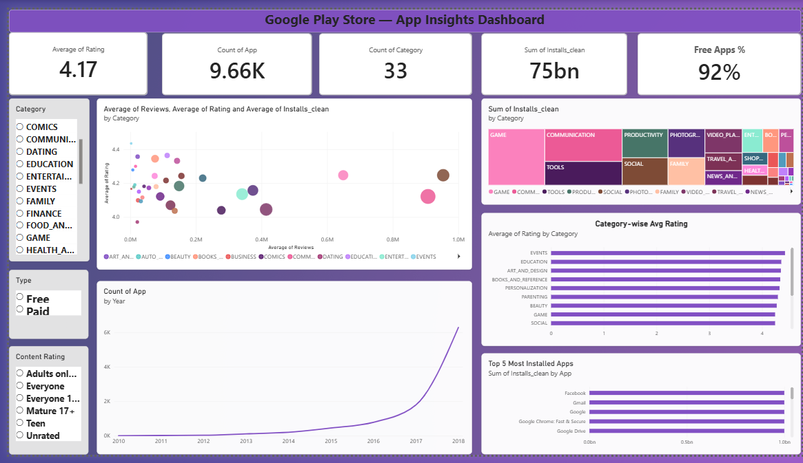
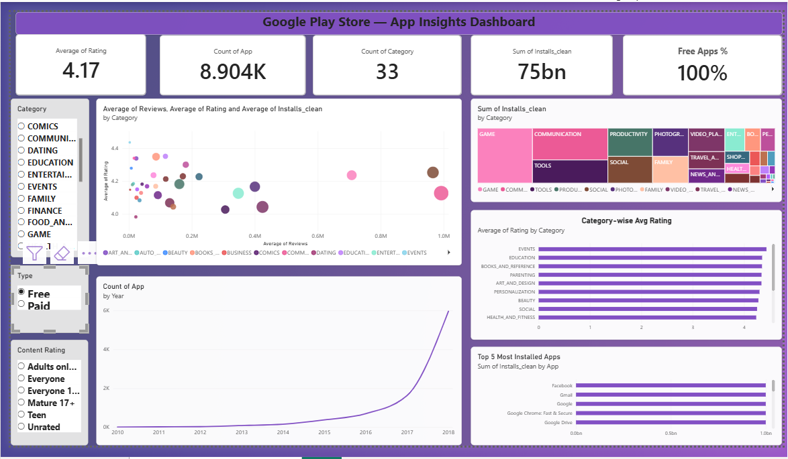
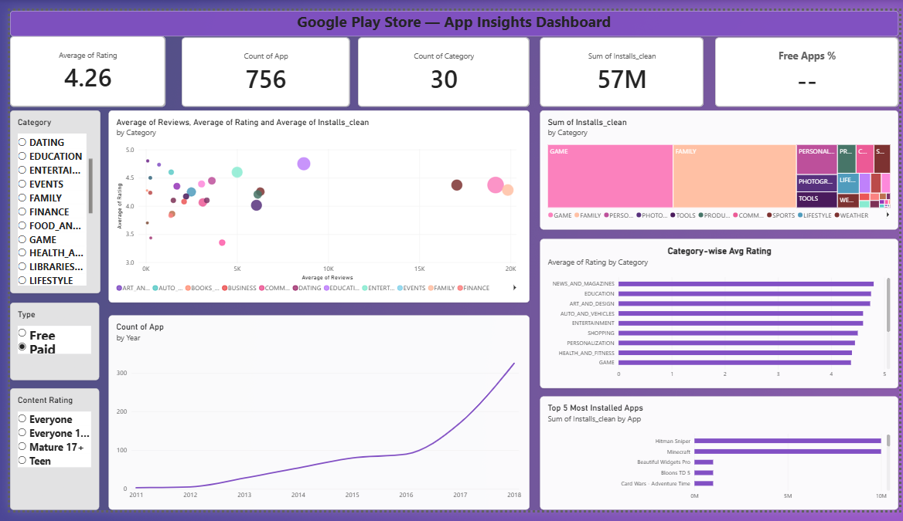

# App Insights Unlocked: Google Play Store Analysis (Power BI)

A data analytics case study on the Google Play Store dataset. The goal is to find out what drives app success (ratings, installs, reviews), how size and price affect user behaviour, and what an app development team can do with those insights.

The data was cleaned in **Power Query**, measures were written in **DAX**, and the results are presented in a single-page **Power BI dashboard**. All 25 case study questions are answered in the [Solution Guide](Solution_Guide.md).

> The same case study is also solved in Tableau: [app-insights-tableau-analysis](https://github.com/sharma9097/app-insights-tableau-analysis)

---

## Dashboard Preview



| Free apps only | Paid apps only |
|---|---|
|  |  |

The dashboard is interactive. The **Category**, **Type** (Free/Paid) and **Content Rating** slicers filter every visual on the page.

---

## Business Problem

A mobile app company wants to use Google Play Store data to improve its app development strategy. The analysis answers three questions:

1. What factors contribute to an app's success on the Google Play Store?
2. How can the company use these factors to improve its own apps?
3. What can be learned about user preferences and behaviour?

**Stakeholders:** app developers, product managers, marketing team and senior management (internal); app users, advertisers and partners (external).

---

## Dataset

| File | Description |
|---|---|
| `googleplaystore.csv` | 10,841 rows of app data: category, rating, reviews, size, installs, type, price, content rating, genres, last updated, versions |
| `googleplaystore_user_reviews.csv` | 64,295 user reviews with sentiment label, polarity and subjectivity |
| `googleplaystore_cleaned.csv` | The cleaned version of the apps table used in the dashboard |

Source: [Kaggle: Google Play Store Apps](https://www.kaggle.com/datasets/lava18/google-play-store-apps). Licensed under [CC BY 3.0](license.txt).

---

## Tools Used

- **Power BI Desktop**: data model, visuals and dashboard
- **Power Query**: data cleaning and type conversion
- **DAX**: measures and calculated columns

---

## Data Cleaning (Power Query)

| Step | Action | Result |
|---|---|---|
| Corrupt row | Removed the row with shifted columns (Category = `1.9`) | 1 row removed |
| Duplicates | Removed duplicate apps on `App` | 10,841 rows to 9,659 unique apps |
| Installs | Removed `,` and `+`, converted to Whole Number | `Installs_clean` |
| Price | Removed `$`, converted to Decimal Number | Numeric price |
| Size | Removed `M`, converted to Decimal Number; "Varies with device" left blank | `Size_MB` |
| Reviews | Converted to Whole Number | Numeric |
| Last Updated | Converted to Date | Date type |
| Missing ratings | Left blank (1,463 apps), not filled | Excluded from rating averages |

---

## Dashboard Contents

| Section | Visuals |
|---|---|
| KPI cards | Average Rating, Total Apps, Total Categories, Total Installs, Free Apps % |
| Filters | Category, Type, Content Rating slicers |
| Category analysis | Treemap of installs by category; bar chart of top categories by average rating |
| Engagement | Scatter chart of average reviews vs average rating (bubble size = installs) |
| Trend | Line chart of apps by last-updated year |
| Popularity | Top 5 most installed apps |

**DAX measures used:**
```
Avg Rating = AVERAGE(googleplaystore_cleaned[Rating])
Free Apps % = DIVIDE(
    CALCULATE(COUNTROWS(googleplaystore_cleaned), googleplaystore_cleaned[Type] = "Free"),
    COUNTROWS(googleplaystore_cleaned))
```

**Coverage note:** the one-page dashboard directly answers about a third of the 25 questions. The [Solution Guide](Solution_Guide.md) answers all 25 and includes the Power BI method for the ones that are not on the dashboard (for example size distribution, price vs rating and sentiment analysis).

---

## Key Findings

- **Average rating is 4.17** (median 4.3); 76.7% of rated apps score 4.0 or higher, so 4.0 is the entry point, not a differentiator.
- **The market is 92% free.** Free apps average about 234K reviews vs about 8.7K for paid apps.
- **Demand is concentrated.** Game, Communication, Tools, Productivity and Social account for 58.8% of the 75 bn total installs.
- **Highest-rated categories:** Events (4.44), Education (4.36), Art & Design (4.36), Books & Reference (4.35). Lowest: Dating (3.97), Maps & Navigation (4.04), Tools (4.04).
- **Installs and rating are barely correlated** (r = 0.04), so popularity does not guarantee quality or the other way round.
- **Price matters mainly at the top end.** Ratings stay around 4.2 to 4.3 up to $10, then drop to 3.91 for apps above $50 (small sample of 16 apps).
- **Users complain about ads, buggy updates and paywalls.** Low-rated apps have 27.6% negative reviews vs 20.8% for high-rated apps.
- **Regular updates are the norm.** About half of apps were updated within 3 months of the latest data date, while 25% had not been updated in over a year.

---

## Recommendations

1. Aim for a rating of **4.3 or higher** to stand out from the typical app.
2. Weigh category choice on both volume (Games, Communication, Tools) and satisfaction (Education, Books, Art & Design).
3. If charging, keep prices low; consider a free tier because free apps collect far more reviews.
4. Update at least quarterly and test releases carefully.
5. Keep ads and monetisation unobtrusive, since they are a top source of negative reviews.
6. Invest in quality and user acquisition separately; one does not drive the other.

---

## Limitations

- Install counts are ranges (for example `1,000,000+`), so totals are lower-bound estimates.
- Each app has one `Last Updated` date, and the data ends on 8 Aug 2018, so update-frequency and seasonality results are indicative only.
- The reviews file covers only about 8% of apps and leans towards games.
- Small groups (for example the 3 "Adults only 18+" apps) should not be over-interpreted.

---

## Repository Structure

```
app-insights-powerbi-analysis/
├── README.md
├── Solution_Guide.md
├── App_Insights_PowerBI_Dashboard.pbix
├── case_study/
│   └── App_Insights_Case_Study.pdf
├── dataset/
│   ├── googleplaystore.csv
│   ├── googleplaystore_user_reviews.csv
│   ├── googleplaystore_cleaned.csv
│   └── license.txt
└── screenshots/
    ├── dashboard_screenshot.png
    ├── dashboard_free_apps.png
    └── dashboard_paid_apps.png
```

---

## How to Open the Dashboard

1. Download `App_Insights_PowerBI_Dashboard.pbix`.
2. Open it in **Power BI Desktop** (free from Microsoft).
3. If Power BI asks for the data source path, point it to `dataset/googleplaystore_cleaned.csv` (Home, Transform data, Data source settings).

---

## Author

**Sujeet Kumar Sharma**
Data Analyst | Power BI, Tableau, Excel, SQL

- GitHub: [sharma9097](https://github.com/sharma9097)
- Portfolio: [sharma9097.github.io/sujeet-portfolio](https://sharma9097.github.io/sujeet-portfolio/)
